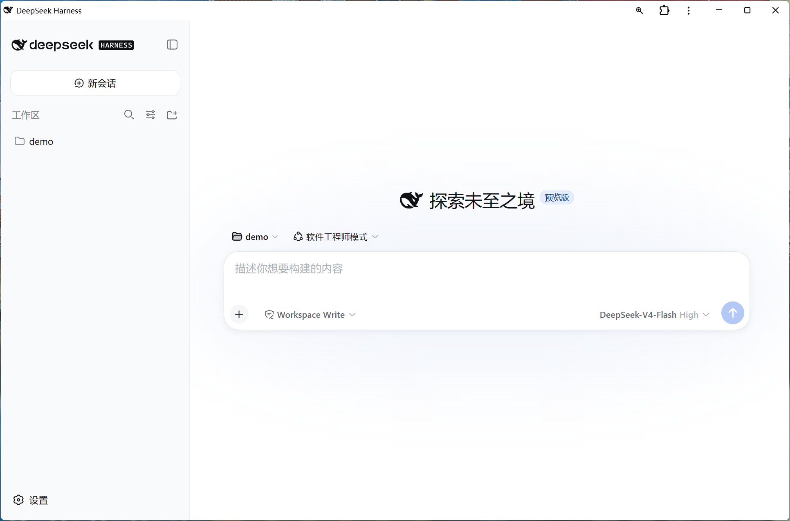

# DSH Windows 托盘启动器

<p align="center">
  
</p>

[English](README.md) | **中文**

这是一个适用于 [DeepSeek Harness（`dsh`）](https://github.com/deepseek-ai/deepseek-harness)的非官方 Windows 系统托盘启动器。

它会在后台执行官方命令 `npx --yes @deepseek-ai/dsh web`，从 DSH 实际输出中提取 Web UI 地址，在就绪后优先以已安装的浏览器 PWA 打开，并在系统托盘提供日常管理菜单。

> 非官方社区项目，与 DeepSeek AI 无隶属关系，也未获得其背书。

## 界面预览

<p align="center">
  
</p>

## 功能

- 使用 C# 编写的原生 Windows 托盘程序，不保留控制台窗口。
- 桌面快捷方式直接指向 EXE，不使用 PowerShell、`ExecutionPolicy Bypass` 或隐藏脚本命令。
- 执行 `npx --yes @deepseek-ai/dsh web`，避免后台运行时停在 npm 安装确认提示。
- 从 `dsh web: <URL>` 输出中提取真实地址，不写死 `3080` 端口；即使 DSH 以后修改了这行提示，也会回退到探测默认端口。
- DSH 就绪后自动打开 Web UI，优先使用已安装的 Chrome 或 Edge PWA，而不是普通浏览器标签页。
- 现代化圆角托盘菜单，包含 **Open DSH**、**Restart DSH** 和 **Exit**。在 Windows 11 上由 DWM 负责圆角，并使用系统级窗口大阴影（与 Electron 应用相同的窗口效果），而不是 WinForms 弹出菜单默认的小硬阴影。
- 安装和卸载通过独立的应用窗口给出反馈，不再使用控制台提示或系统自带的消息框；编译一结束控制台就会自动关闭。
- 单实例保护：重复双击快捷方式只打开当前页面，不重复启动 DSH。
- 使用 Windows 作业对象（job object）托管 DSH 进程树：即使启动器被强制结束、崩溃或用户注销，Windows 也会连带清理整棵进程树，不会残留服务器进程。
- 启动时若发现旧的 DSH 服务器仍占用 `3080` 端口，会自动回收该端口，而不是直接以 `EADDRINUSE` 启动失败。
- 使用 DSH 官方鲸鱼轮廓制作多尺寸黑色 Windows 图标。
- 按当前用户安装，不需要管理员权限。

## 系统要求

- Windows 10 或 Windows 11
- 已安装 Node.js、npm 和 npx
- `npx` 需要下载 `@deepseek-ai/dsh` 时能够访问网络
- Windows .NET Framework C# 编译器（正常的 Windows .NET Framework 环境通常已经包含）

## 安装

1. 下载或克隆本仓库。
2. 保持 `Install.cmd`、`DeepSeekHarnessTray.cs` 和 `dsh-favicon-black.svg` 位于同一文件夹。
3. 双击 `Install.cmd`，不要选择“以管理员身份运行”。
4. 控制台窗口只在编译期间短暂出现，随后自动关闭，并弹出安装结果窗口。
5. 在该窗口点击 **Start DeepSeek Harness** 即可启动，也可以之后双击桌面快捷方式。

如果某个编译步骤失败，控制台会保留并显示编译器输出，同时把相同内容写入脚本旁边的 `install.log`。

安装器会在本机编译公开的 C# 源码，生成多尺寸图标并嵌入 EXE，然后安装至：

```text
%LOCALAPPDATA%\DeepSeekHarnessTray
```

安装器还会为当前用户创建桌面和开始菜单快捷方式，快捷方式直接指向安装后的 EXE。

## 日常使用

需要使用 DSH 时，双击桌面的 **DeepSeek Harness** 快捷方式即可。

- 启动器未运行时：后台启动 DSH，检测就绪地址后自动打开浏览器。
- 启动器已经运行时：重复启动只打开当前 DSH 页面，不产生第二个实例。
- 单击托盘图标打开 DSH；右键打开菜单（**Restart DSH**、**Exit**）。
- **Restart DSH**：仅重启由启动器管理的 DSH 进程树。
- **Exit**：关闭 DSH 进程树和托盘启动器。

DSH 不需要永久驻留后台。选择 **Exit** 后，下次使用时重新双击桌面快捷方式即可。

## 更新

1. 使用新版本文件替换仓库文件。
2. 再次运行 `Install.cmd`，重新编译并覆盖安装。

如果启动器正在运行，安装程序会先询问是否关闭它，因此不必事先从托盘选择 Exit。DSH 会随启动器一起停止，安装完成后可重新启动。

## 卸载

在下载的仓库文件夹中双击 `Uninstall.cmd`，它同样会先询问是否关闭正在运行的启动器。

## 日志和状态文件

```text
%LOCALAPPDATA%\DeepSeekHarnessTray\dsh-web.log
%LOCALAPPDATA%\DeepSeekHarnessTray\dsh-web-error.log
%LOCALAPPDATA%\DeepSeekHarnessTray\dsh-web.url
```

只有在 DSH 报告了有效的 HTTP/HTTPS 地址并保持运行时，`dsh-web.url` 才会存在。重启和选择 **Exit** 时会清除该文件；若启动器被强制结束，则在下次启动时清除，避免打开失效地址。

`dsh-web.log` 中还会记录启动器自身的动作，以 `[tray]` 开头，例如回收被旧 DSH 服务器占用的 `3080` 端口。

## 故障排查

**托盘图标出现了，但浏览器没有自动打开，Open DSH 也是灰的。**
只有在 DSH 报告出可用地址之后，Open DSH 才会启用，因此灰化说明 DSH 根本没有启动成功。请查看 `dsh-web-error.log`：如果结尾是 `EADDRINUSE ... 127.0.0.1:3080`，说明旧的 DSH 服务器仍占用端口；选择 **Restart DSH** 即可，新版本会自动回收端口。

**选择 Exit 之后，浏览器里仍然能打开 DSH。**
这说明存在 1.3.0 之前版本残留的服务器进程。执行下面的命令清理一次：

```powershell
Get-NetTCPConnection -LocalPort 3080 -State Listen |
  ForEach-Object { Stop-Process -Id $_.OwningProcess -Force }
```

**首次启动需要好几分钟。**
首次执行 `npx --yes @deepseek-ai/dsh` 需要先下载并安装 DSH，之后服务器才会监听端口。这段时间托盘提示会显示 `Starting...`。

## 安全说明

- 启动器提供完整源码，并在用户电脑上本地编译。
- 安装后的快捷方式直接指向 EXE。
- 只接受从 DSH 输出中提取的 HTTP/HTTPS 地址；除 DSH 自己声明的地址外，仅接受本机回环地址。
- 结束进程时以启动器自己创建的作业对象为范围，只终止其中的 DSH 进程树，不会结束无关的 Node.js 程序。
- 启动时占用 `3080` 端口的进程，只有在命令行可确认为 DSH 时才会被终止；无法确认时会先弹窗征求同意；如果明显是其他程序，则拒绝启动并提示占用端口的进程名和 PID。
- 本地编译的 EXE 未进行代码签名，Windows 或安全软件仍可能进行正常的信誉检查。

## 图标和商标

鲸鱼轮廓来自 DeepSeek Harness 官方仓库的 [`website/public/favicon.svg`](https://github.com/deepseek-ai/deepseek-harness/blob/master/website/public/favicon.svg)，本项目将其改为黑色。详细来源见 [NOTICE.md](NOTICE.md)。

DeepSeek、DeepSeek Harness 及其图标可能是相应权利人的商标。本项目仅用于说明兼容关系，不代表官方认可或背书。

## 许可证

启动器代码使用 [MIT License](LICENSE) 发布。
